# Terraform-Advanced
## Домашнее задание к занятию «Управляющие конструкции в коде Terraform»

### Задание 1

  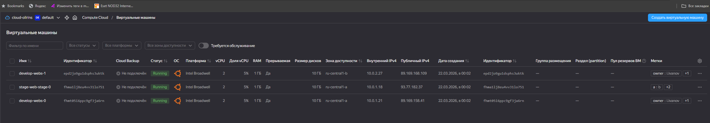
   
  <em>скриншот консоли ВМ yandex cloud с их метками</em>

  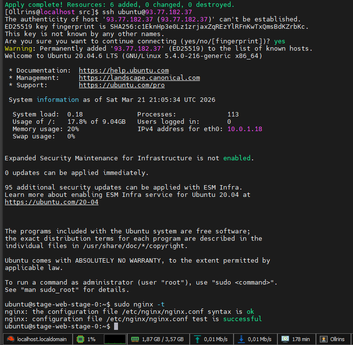
   
  <em>скриншот подключения к консоли и вывод команды sudo nginx -t</em>

  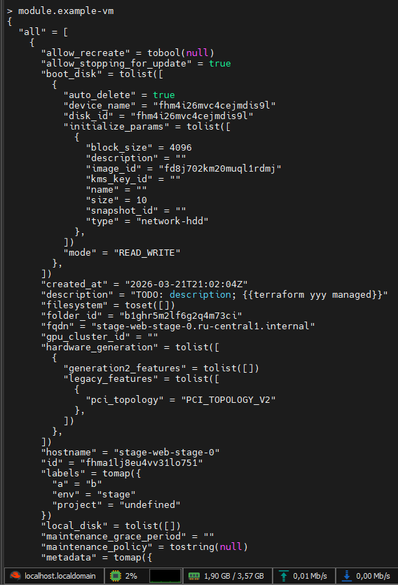
   
  <em>terraform console вывод модуля</em>

  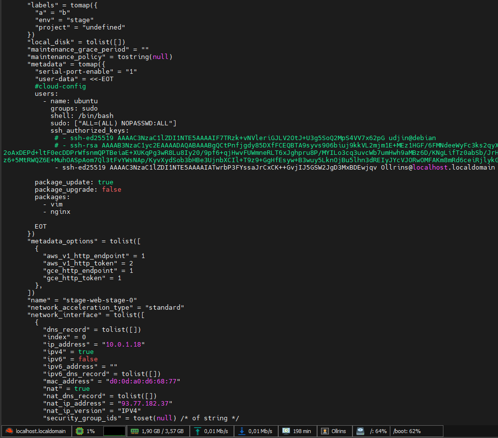
   
  <em>terraform console вывод модуля - продолжение</em>

### Задание 2

  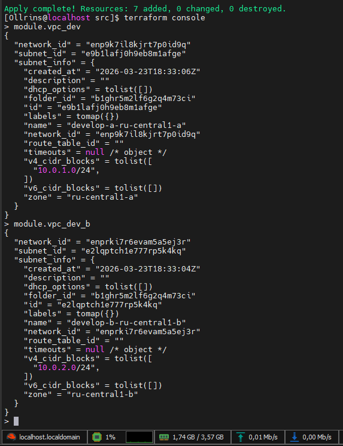
   
  <em>terraform console вывод модуля</em>

 

  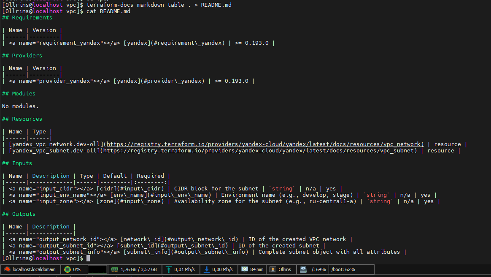
   
  <em>документация к модулю с помощью terraform-docs</em>

### Задание 3

  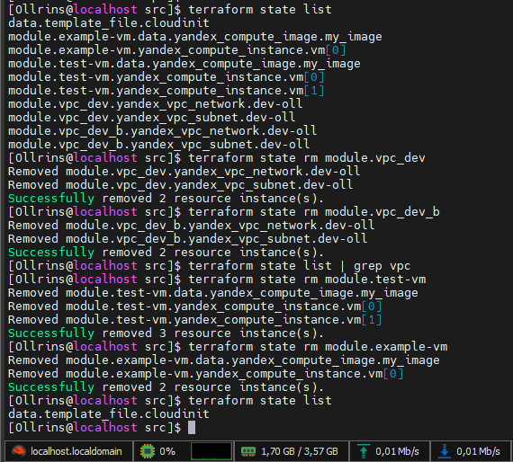
   
  <em>список ресурсов в стейте,  удаление из стейта модулей  vpc и vm</em>

 

  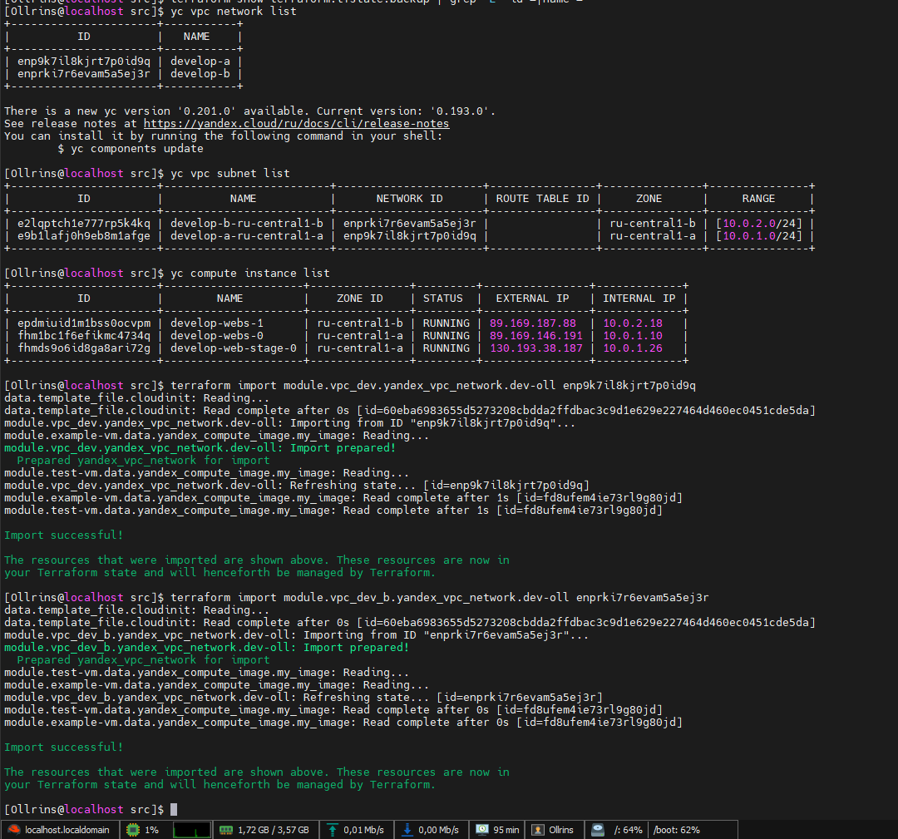
   
  <em>импортирт модуля  vpc</em>

 

  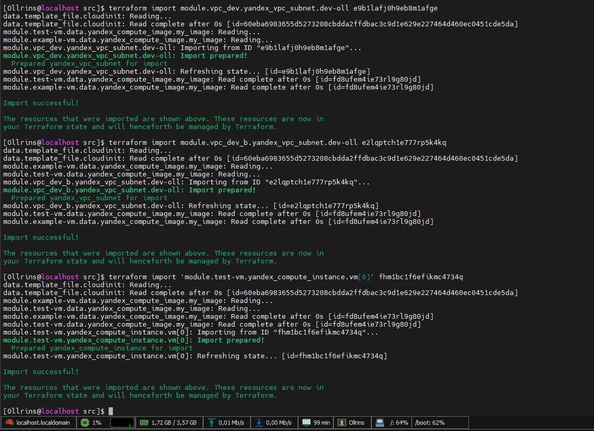
   
  <em>импортирт модуля vm</em>

 

  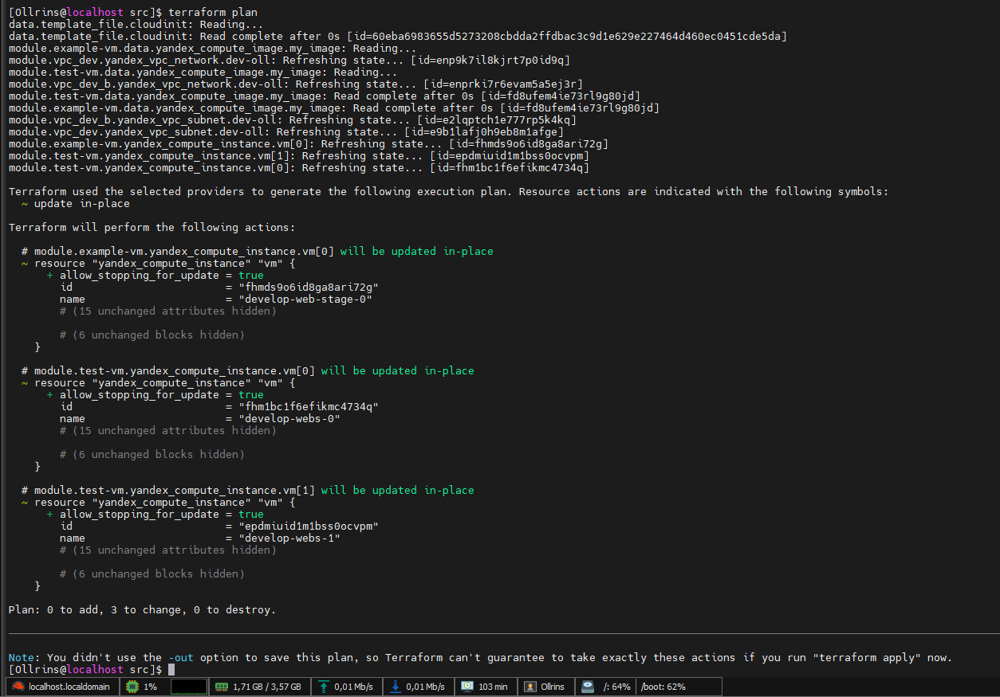
   
  <em>terraform plan</em>

 

### Задание 4

  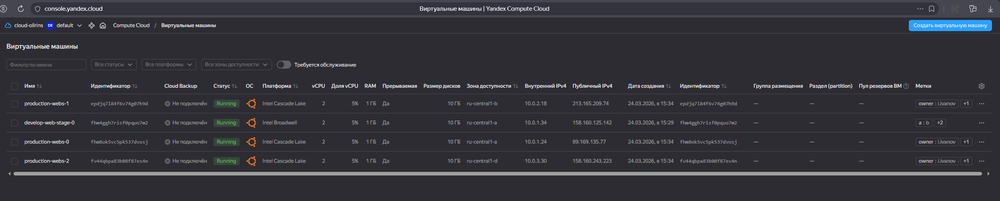
   
  <em>модуль vpc для создания подсетей во всех зонах доступности, результат из консоли YC</em>

 

### Задание 7

  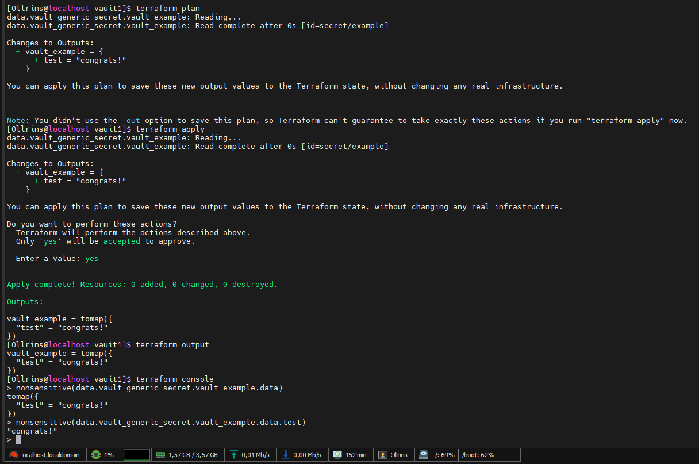
   
  <em>секрет с помощью terraform vault, вывод в output</em>

 

  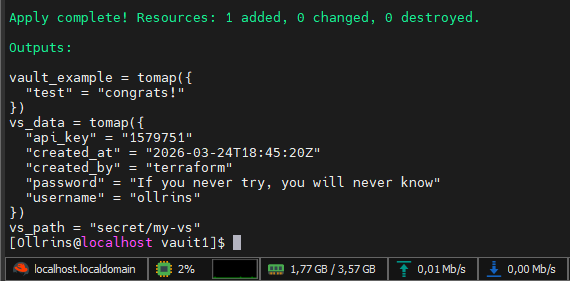
   
  <em>новый секрет в vault с помощью terraform</em>

 

